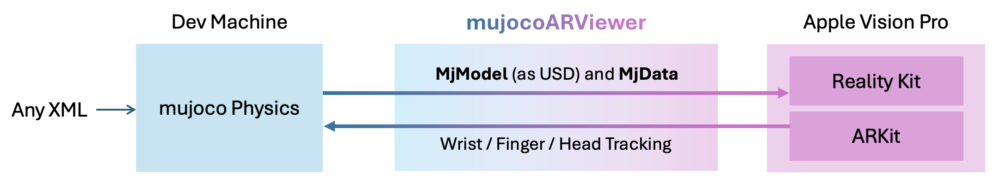

# MuJoCo AR Viewer

A Python package for visualizing MuJoCo physics simulations in Augmented Reality using Apple Vision Pro and other AR devices.




## Installation

```bash
pip install mujoco-ar-viewer
```

To use automatic MuJoCo XML-to-USD conversion feature (supported only on Linux and Windows via ), use: 

```
pip install "mujoco-ar-viewer[usd]"
```

Note that 

## Quick Start

```python
from mujoco_arviewer import MJARViewer
import mujoco

# Initialize the AR viewer with your device's IP
viewer = MJARViewer(avp_ip="192.168.1.100")

# Send a MuJoCo model to the AR device
viewer.load_scene("path/to/your/model.xml", attach_to = [0, 0, 0.3, 1, 0, 0, 0])

# Set up your MuJoCo simulation
model = mujoco.MjModel.from_xml_path("path/to/your/model.xml")
data = mujoco.MjData(model)

# Register the model and data with the viewer
viewer.register(model, data)

# Simulation loop
while True:
    # Step the simulation
    mujoco.mj_step(model, data)
    
    # Sync with AR device
    viewer.sync()
```

## License

MIT License

## Contributing

Contributions are welcome! Please feel free to submit a Pull Request.